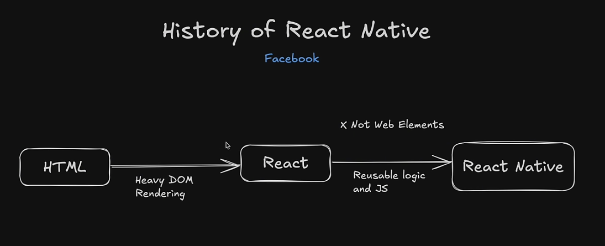
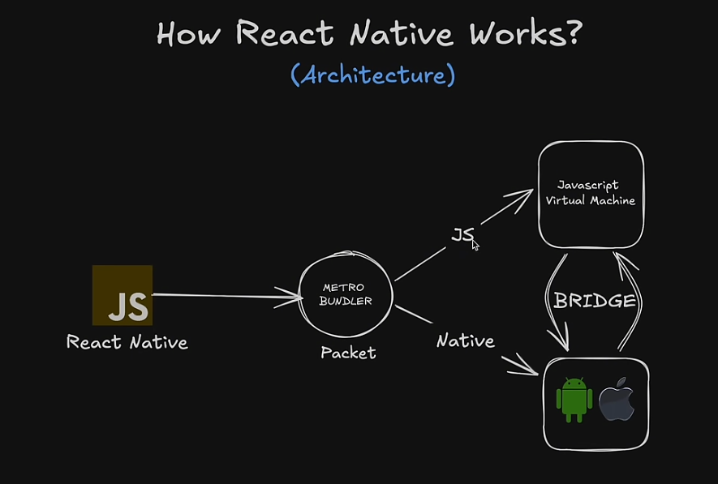
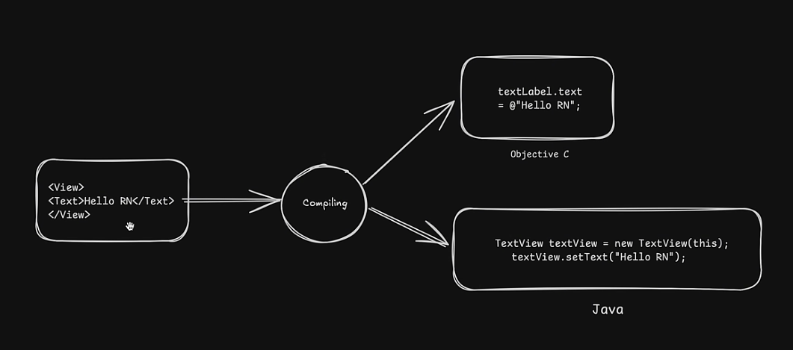
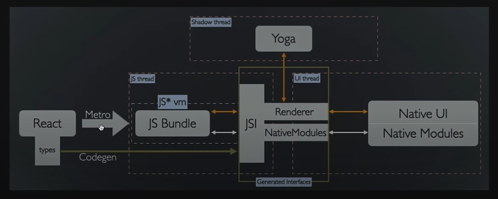

# React Native Practice

### **History of React Native**




---

### **How React Native Works**



React Native architecture is based on a **bridge** between JavaScript and the native components of mobile platforms (iOS and Android). Let me break it down for you in simple terms with an example.

1. **JavaScript Layer**:
   - Your app's logic (written in JavaScript) runs on a separate **JavaScript thread** using a JavaScript engine like **Hermes** (for React Native) or **V8**.
   - You write your app in React Native components, like `View`, `Text`, `Image`, etc., which are cross-platform abstractions.

2. **Bridge**:
   - React Native uses a **bridge** to communicate between the JavaScript code and the Native side (Android/iOS).
   - This bridge converts JavaScript instructions into native commands.

3. **Native Layer**:
   - React Native maps your JavaScript code to the native UI elements for Android (Java/Kotlin) or iOS (Objective-C/Swift).
   - For example, a `View` in React Native maps to an **Android View** on Android and an **UIView** on iOS.

---

### **Illustrative Example**
Suppose you create a React Native button:

```javascript
import React from 'react';
import { Button, Alert } from 'react-native';

export default function App() {
  return (
    <Button
      title="Click Me"
      onPress={() => Alert.alert('Button Clicked!')}
    />
  );
}
```



#### Behind the Scenes:
1. **JavaScript Layer**:
   - The button component (`Button`) is written in JavaScript.
   - When you click it, the `onPress` function runs in the JavaScript thread.

2. **Bridge**:
   - The `onPress` event and the associated logic are passed through the bridge.
   - The bridge tells the native platform, “Hey, this button was clicked, run the native alert!”

3. **Native Layer**:
   - On Android, a native `Button` is used, and the `Alert` triggers an Android native dialog.
   - On iOS, a native `UIButton` is used, and the `Alert` triggers an iOS native dialog.

---



### **Analogy**
Think of React Native as a **translator**:
- You (JavaScript) speak one language, and the phone (Native) speaks another.
- The **bridge** is the translator that allows communication between you and the phone.

---

### **Why is this Bridge Important?**
The bridge ensures that you can:
- Write your logic in **one codebase** (JavaScript) for both platforms.
- Still use **native performance and UI components** for iOS and Android.

---

### **Modern Optimizations**
React Native is evolving to improve performance:
1. **Fabric**: A new architecture that directly connects the JavaScript and native layers without as much reliance on the bridge.
2. **Hermes Engine**: A faster JavaScript engine designed for React Native apps.

Let me know if you'd like further clarification on any part of this!


